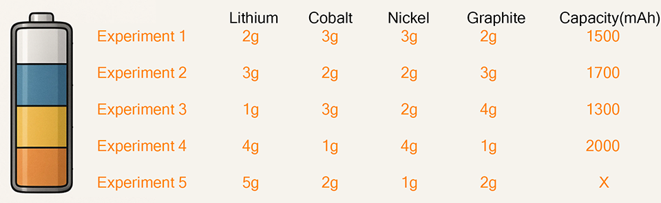
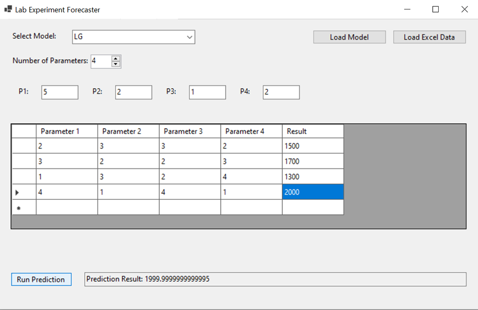
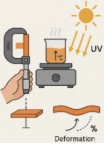
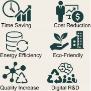

# **Experiment** **Predictium (Lab Experiment Forecaster)**
## Purpose of the Application:
This application allows users to upload experimental data and predict future experimental outcomes using various deep learning models (LG, RFR, ANN, LSTM, GRU, TFT, CNN\_LSTM). Users can either choose from pre-built models or upload their own custom models. By uploading an Excel file containing experimental content and results, users can generate predictions.

|**Abbreviation**|**Full Form**|**Description**|
| :- | :-: | :-: |
|**LG**|**Linear Regression**|The most basic regression model is used to model linear relationships.|
|**RFR**|**Random Forest Regressor**|It is an ensemble method consisting of decision trees and provides high accuracy.|
|**ANN**|**Artificial Neural Network**|Artificial neural network; feedforward MLP architecture is generally used.|
|**LSTM**|**Long Short-Term Memory**|It is a type of RNN that has a forgetting and remembering mechanism developed for time series and sequential data.|
|**GRU**|**Gated Recurrent Unit**|Similar to LSTM but simpler and faster; works with sequential data.|
|**TFT**|**Temporal Fusion Transformer**|It is an advanced attention-based model developed specifically for time series data.|
|**CNN\_LSTM**|**Convolutional Neural Network + LSTM**|It first processes the data with CNN for spatial features, then uses LSTM for time dependence.|

##
# Scenarios for various usage areas:
## 1\. Chemical and Pharmaceutical Industry
*•*Reaction Efficiency Estimation:

*Example: Predicting the yield of a chemical reaction under different temperatures, pressures and catalyst concentrations.*

*How to Use?*

*Parameters: Temperature (°C), Catalyst Amount (g), Reaction Time (min)*

*Result: Product Yield (%)*

*• Drug Formulation Optimization:*

*Example: Analyze the factors that affect the dissolution rate of a new painkiller tablet.*

*How to Use?*

*Parameters: Binding Agent Ratio, Compaction Pressure (MPa), Moisture Content (%)*

*Result: Dissolution Time (minutes)*

## 2\. Materials Science
*• Polymer Durability Test:*

*Example: Predicting the heat resistance of a newly synthesized polymer.*

*How to Use?*

*Parameters: Polymer Thickness (mm), Temperature (°C), UV Exposure Time (hours)*

*Result: Deformation Rate (%)*

*• Metal Alloy Hardness:*

*Example: Modeling the factors that determine the hardness of a titanium alloy.*

*How to Use?*

*Parameters: Carbon Content (%), Annealing Time (hours), Cooling Rate (°C/min)*

*Result: Vickers Hardness Value*

## 3\. Agriculture and Food Science
*• Soil Fertility Analysis:*

*Example: Estimating the effect of fertilizer components on wheat yield.*

*How to Use?*

*Parameters: Nitrogen (kg/ha), Phosphorus (kg/ha), Irrigation Frequency (days)*

*Result: Production per Hectare (tons)*

*• Food Shelf Life Estimation:*

*Example: Determining the factors affecting the spoilage time of packaged milk.*

*How to Use?*

*Parameters: Storage Temperature (°C), Packaging Pressure (atm), Preservative Ratio (%)*

*Result: Shelf Life (days)*

## 4\. Energy and Battery Technologies
*• Lithium-Ion Battery Life Modeling:*

*Example: Estimating how battery capacity decreases depending on charge-discharge cycles.*

*How to Use?*

*Parameters: Charge Current (A), Ambient Temperature (°C), Number of Cycles*

*Result: Capacity Loss (%)*

*• Solar Panel Efficiency:*

*Example: Analyze the effect of panel angle and weather conditions on energy production.*

*How to Use?*

*Parameters: Panel Tilt Angle (°), Radiation Intensity (W/m²), Temperature (°C)*

*Result: Energy Output (kWh)*

## 5\. Environmental Engineering
*• Wastewater Treatment Efficiency:*

*Example: Measuring the effect of pH and coagulant amount in chemical precipitation process.*

*How to Use?*

*Parameters: pH Value, Coagulant Concentration (mg/L), Stirring Speed ​​(rpm)*

*Result: Suspended Solids Removal (%)*

*• Air Pollution Distribution:*

*Example: Modeling how factory emissions spread depending on wind speed and direction.*

*How to Use?*

*Parameters: Emission Value (ppm), Wind Speed ​​(m/s), Humidity (%)*

*Result: PM2.5 Concentration (µg/m³)*

## 6\. Education and Academic Research
*• Student Projects:*

*Example: Science students analyzing simple electrochemical cell experiments.*

*How to Use?*

*Parameters: Electrolyte Concentration (M), Electrode Material, Temperature (°C)*

` `*Result: Voltage Output (V)*

*• Article Support Applications:*

*Example: Researchers quickly model experimental data to validate paper results.*

## 7\. Industrial Manufacturing
*• Plastic Injection Mold Optimization:*

*Example: Determine the effect of injection pressure and temperature on product defect rate.*

*How to Use?*

*Parameters: Pressure (bar), Temperature (°C), Cooling Time (sec)*

*Result: Defect Rate (%)*

*• Paint Durability Test:*

Example: Estimating the resistance of automotive paints to UV rays.

How to Use?

Parameters: UV Exposure Time (hours), Paint Thickness (µm), Humidity (%)

Result: Color Fading Rate (%)

## System Requirements:
.NET Framework 4.7.2 or later

For Excel files: Excel 2007+ (.xlsx) support

Required libraries for Python integration:

Numpy, pandas, scikit-learn, xgboost, tensorflow, torch, pytorch-lightning, darts

## Installation:
### .bat file for Windows (example name: install\_requirements.bat)
@echo off

echo Installing required Python libraries...

pip install numpy pandas scikit-learn xgboost tensorflow torch pytorch-lightning darts

echo Installation completed.

Pause

### .sh file for Linux/macOS (example name: install\_requirements.sh)
#!/bin/bash

echo "Installing required Python libraries..."

pip install numpy pandas scikit-learn xgboost tensorflow torch pytorch-lightning darts

echo "Installation completed."

### On Linux/macOS, don't forget to give the file executable permission first:
chmod +x install\_requirements.sh

./install\_requirements.sh

## Launching the Application:
When the application is launched, a user interface (UI) is displayed in the main window for model selections and entering the required parameters.

## User Interface Components:
Model Selection (ComboBox): User can select the type of model to be used (LG, RFR, ANN, LSTM, GRU, TFT, CNN\_LSTM).
Number of Parameters (NumericUpDown): User can select the number of parameters (between 1 and 20).
Excel Data Loading (Button): User can load data from an Excel file.
Custom Model Loading (Button): User can load a custom model file (zip, h5, pt, pkl).
Data Input (DataGrid): User can enter parameters and results into a table.
Make Prediction (Button): User can make predictions with given parameters and data.
Prediction Result (TextBox): Prediction result is displayed here.

# Step by Step Usage:
## Model Selection:
Select the model to use for prediction from the drop-down menu under "Select Model". Click on the list to select one of the models.
## Determining the Number of Parameters:
From the "Number of Parameters" option, specify the number of parameters to be used (between 1 and 20). This determines the number of input parameters for the model.
When the number of parameters is changed, the input fields are automatically updated.
## Data Loading:
Click the "Load Excel Data" button to load Excel data. The data will be loaded from the Excel file and transferred to the DataGrid table. o Make sure the data is loaded correctly. Your Excel file must have enough columns (parameters + results).
## Custom Model Upload:
1. If you want to use a custom model, click the "Load Custom Model" button to select the model file. Supported file types: .zip, .h5, .pt, .pkl.
1. The model you upload will be added to the model list and can be selected.
## Parameter Entry:
1. Labels and input fields for the parameters will be visible, each placed in a text box. Enter each parameter accordingly.
1. Make sure you fill in all the parameters. You must enter numerical values.

## Making a Guess:
After entering your data and parameters, click the "Run Prediction" button. 

The application will make a prediction based on the selected model and the given data and display the result in the text box below.
## Important Notes:
### Excel Data:
Each row in the Excel file is an experiment sample. Each column represents a parameter and a result value.

Your Excel file must have a sufficient number of columns (number of parameters + results).
### Model Selection:
If you want to use your own model, you can select the model file you uploaded. The application accepts supported model file types (zip, h5, pt, pkl).
### Prediction Results:
The prediction made is displayed in the "Prediction Result" field. This result represents the value predicted by the model.
### Error Messages:
• Missing Data: All cells must be filled in. If a cell is left blank, the user will be shown an error message.

• Invalid Data: Parameters must be numeric. If text or invalid data is entered, the user will be shown an error message.

• Model and Data Loading Errors: Errors encountered during Excel or model loading will be shown to the user.
# Conclusion:

This application allows users to upload experimental data and predict future experimental results using various deep learning models. This way, the digitization of experimental processes and prediction with machine learning provides time, cost, resource and environmental efficiency in a wide range of areas.
### 🎯 1. Time Saving
- Instead of physically performing experiments over and over again, a model trained with just a few examples can make predictions in seconds.
- Long-term experiments and parameter ranges can be scanned virtually with the model.
### 💰 2. Cost Reduction
- Less chemicals, materials and equipment are consumed by reducing the number of experiments.
- Manpower, device usage and laboratory resources are saved.
### ⚙️ 3. Energy Efficiency
- Experiments that consume energy such as heating, cooling, UV exposure, compression are only performed when necessary. • In this way, unnecessary energy consumption is reduced.
### 🌱 4. Environmental Impact Reduction
- ` `Less experimentation = less waste production (chemical, plastic, energy etc.)
- Contributes to the green laboratory approach.
### 📈 5. Optimization and Quality Improvement
- Targets such as maximum efficiency, durability or resolution can be achieved by manipulating input parameters.
- Product development processes are carried out more consciously.
### 6\. Digital R&D and Simulation Support
- Different formulations, conditions or scenarios can be tested in a virtual environment.
- This supports innovation and rapid iteration in R&D processes.
